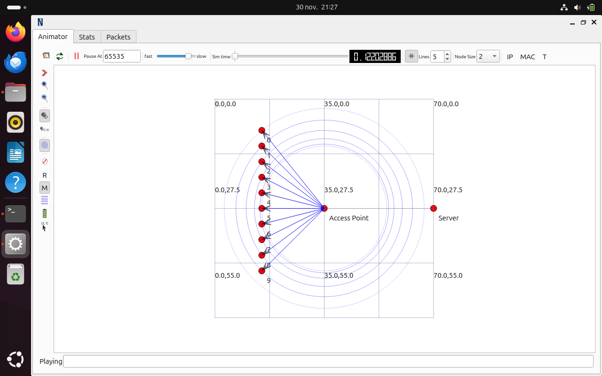
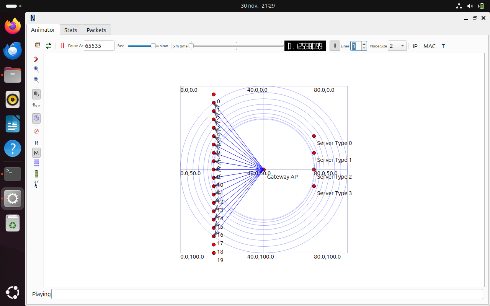

# 📡 Simulation de Réseau Domestique IoT & Génération de Dataset ML (ns-3)

Ce dépôt contient le code source et les outils développés pour simuler un réseau domestique connecté (Smart Home) sous **ns-3**. L'objectif est de générer des traces réseaux réalistes et étiquetées pour entraîner des modèles de Machine Learning (Classification de trafic).

## 📝 Contexte du Projet

Dans un scénario de maison connectée comportant $N$ équipements de $K$ types différents (Caméras, Capteurs IoT, Ordinateurs, Téléphones VoIP), ce projet vise à :
1.  **Simuler** le trafic réseau généré par ces applications via Wifi 802.11ac.
2.  **Introduire de la variabilité** (spatiale, temporelle et physique) pour éviter le déterminisme et le sur-apprentissage.
3.  **Capturer et Transformer** les traces brutes (.pcap) en un Dataset structuré (.csv) exploitable par des algorithmes de ML.

## 📈 Méthodologie et Évolution

Le projet a été construit selon une approche itérative rigoureuse, validant chaque étape avant de complexifier le modèle.

### Phase 1 : Validation Topologique (Simulation 1 & 2)
Nous avons d'abord validé l'infrastructure réseau (Positionnement, Routage Wifi vers Ethernet) sur des scénarios allégés (N=10) à l'aide de l'outil **NetAnim**.

| Simulation 1 (Basique) | Simulation 2 (Multi-Services) |
|:---:|:---:|
| Validation du lien AP <-> Client | Validation du routage vers K Serveurs distincts |
|  |  |
| *10 Clients identiques, 1 Serveur* | *Clients alignés à gauche, Serveurs dédiés à droite* |

### Phase 2 : Collecte et Variabilité (Simulation 3 & 4)
Une fois la topologie validée, nous sommes passés à l'échelle ($N=25-30$) pendant 60 secondes en introduisant :
*   **Capture de données** : Activation du mode promiscuité (PCAP) sur le Point d'Accès.
*   **Modèle Physique Réaliste** : Ajout du *Nakagami Fading* pour simuler les fluctuations du signal radio.
*   **Aléatoire** : Variation des tailles de paquets et des temps de départ pour chaque nœud.

## 📂 Structure du Dépôt

L'organisation des fichiers suit la logique de production de données :

- **`workspace/ns-allinone-3.45/ns-3-dev/scratch`** : Codes sources C++ des simulations (pour le dossier `scratch` de ns-3).
  - `wifi-data-generation4.cc` : **Version finale** (Variabilité complète, Fading, Logs).
  - `wifi-data-generation[1-3].cc` : Versions intermédiaires (Topologie, Capture).
- **`/workspace/analysis`** : Pipelines de traitement de données (Python).
  - `pcap_to_dataset_final.py` : **Script final**. Réalise un fenêtrage temporel (1s), calcule l'IAT (Inter-Arrival Time) et génère les stats pour l'entrainement.
  - `pcap_to_dataset.py` : Première version (Packet-based). Convertit chaque paquet brut en ligne CSV.
- **`/workspace/ns-allinone-3.45/ns-3-dev`** : Échantillons de résultats générés.
  - `wifi-traces-25-1.pcap` : Extrait de capture brute.
  - `maison_animation4.xml` : Fichier de visualisation pour NetAnim final.
- **`/workspace/analysis`** : Exemple du dataset prêt pour l'entraînement.
  - `dataset_final.csv`
